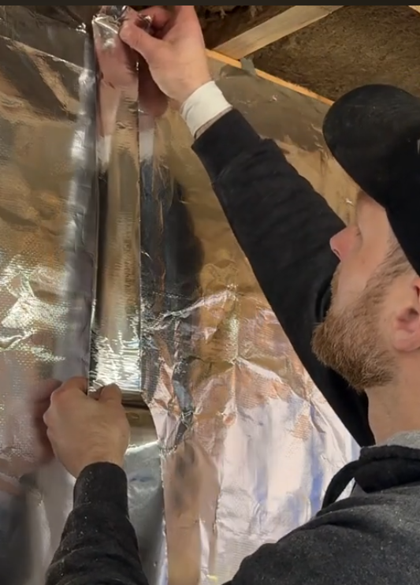
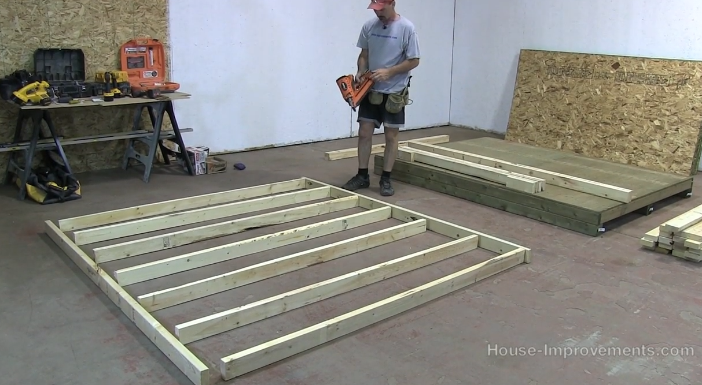
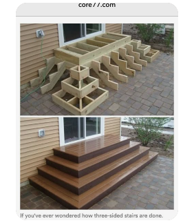
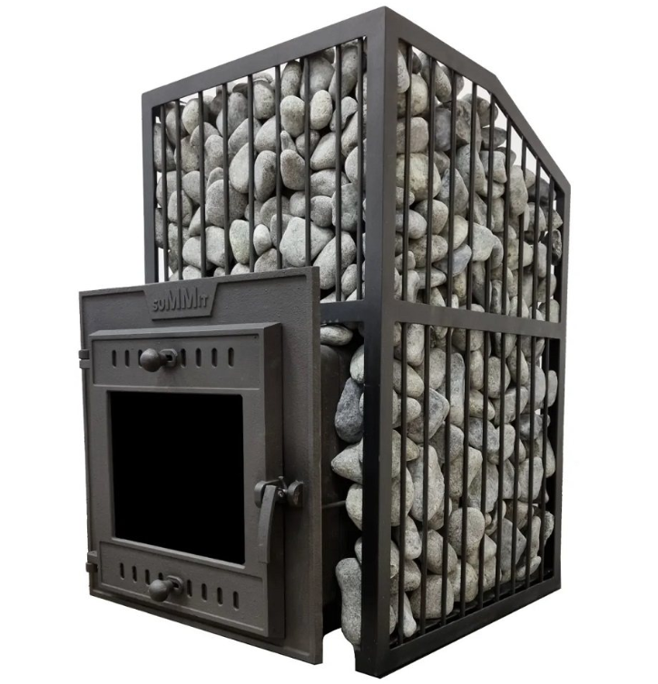

# Notes on Gardening 

- This file was first created: 2022-07-07 05:58:17

# TODO

    
todos

<iframe
  src="https://app.todoist.com/app/project/106-6HGhQG9xCP8Rq3cx"
  style="width:80%; height:800px;"
></iframe>

# WIP notes

- add wip

# WIP urls
    
- [notes.md](notes.md)
- https://chatgpt.com/c/67d08fec-eed4-8006-82b9-12a7556c458b
- https://app.todoist.com/app/project/6XVCPVqCJvhhH4FV
- https://localmile.org/trumpkins-intro-to-sauna/
- https://app.todoist.com/app/label/garden-2153657263
- https://app.todoist.com/app/project/106-6HGhQG9xCP8Rq3cx

# LINKS

- https://www.kew.org/science/collections-and-resources/data-and-digital
- https://localmile.org/trumpkins-intro-to-sauna/

# Plans

# NOTES

## Mon 2025-04-14

## Sun 2025-04-13

- Sauna culture in Finland
https://www.youtube.com/watch?v=qY__OOcv--M

## Thu 2025-04-03

https://www.tinywoodstove.com/how-to-build-heat-shields-for-wood-stoves/#:~:text=Distances%20to%20Combustibles%20Without%20Shielding,an%20air%2Dcooled%20heat%20shield

## Sun 2025-03-30

- https://nasdonline.org/1248/d001052/wood-stove-installation-and-operation.html

- https://www.hearth.com/talk/threads/tips-on-safe-and-efficient-heat-shield-with-durock-cement-board-and-brick-veneer.178159/?utm_source=chatgpt.com

https://www.usg.com/content/dam/USG_Marketing_Communications/canada/product_promotional_materials/finished_assets/cgc-construction-handbook-ch04-cement-board-construction-can-en.pdf?utm_source=chatgpt.com

- https://www.usstove.com/wp-content/uploads/2020/01/853614-US1269E-EN_FR.pdf

[853614-US1269E-EN_FR.pdf](853614-US1269E-EN_FR.pdf)

- https://www.cityofmtcarmel.com/media/6586

- https://www.hearth.com/talk/threads/wood-stove-wall-clearances-primer.147785/

## Wed 2025-03-26

## Sun 2025-03-23

https://www.youtube.com/watch?v=jgFhBuyaAi8

## Sat 2025-03-22

You would need approximately 117 of the 1-in x 4-in x 8-ft spruce pine fir furring strips to cover the walls and ceiling of your sauna, including a 10% buffer for waste.

- https://www.youtube.com/watch?v=kv-8PSKd1bk

https://www.youtube.com/watch?v=jaHo8U_gmNs

https://www.amazon.com/dp/B0DN56RGL5/ref=sspa_dk_detail_5?pd_rd_i=B0DN4RF8HL&pd_rd_w=EkoNL&content-id=amzn1.sym.953c7d66-4120-4d22-a777-f19dbfa69309&pf_rd_p=953c7d66-4120-4d22-a777-f19dbfa69309&pf_rd_r=JHJ5HXSVJ60248H14HMP&pd_rd_wg=Z2x2o&pd_rd_r=704a47d9-c3c2-4368-8059-8babcc3870fc&s=hi&sp_csd=d2lkZ2V0TmFtZT1zcF9kZXRhaWwy&th=1

https://www.lowes.com/pd/SuperVent-36-in-L-x-6-in-dia-Stainless-Steel-Insulated-Double-Wall-Stainless-Chimney-Pipe/3134409

From Heat Shield to Wall: The heat shield should be mounted with a 1-inch ventilated air space between it and the combustible wall. 

## Wed 2025-03-19

Rafters:

- https://www.youtube.com/watch?v=jlAj-pLksMg

## Fri 2025-03-14

### Steps

It is 21" from the grass to the entrance, so three risers.

### Building a 6 by 8 shed

Floor:

- https://www.youtube.com/watch?v=Xh_QMJALct4

Walls:

- https://www.youtube.com/watch?v=JmbmEHdbdoU

### Framing a door and window

- https://www.youtube.com/watch?v=oXfVf48rAug

Add half an inch on each side of a window or a door, so if the jam is 48", the opening is 49.

Trimmer supports the header.

King stud is the full length of the wall:

Trimmer or jack stud supports the header, attached to the king stud every 16".

Cripples are under the windows and support the sill and header.  Header size depends on code and load.  For shed, probably doesn't need to be much.

Short cripple studs at the top.

Door header:

### Ideas

- https://www.timbertech.com/ideas/deck-steps-ideas/

- https://localmile.org/trumpkins-notes-on-building-a-sauna/

- https://localmile.org/saunaphotos/

- https://localmile.org/dolomitessauna/

- https://www.saunaexperience.fi/

- https://saunologia.fi/in-english/

https://saunologia.fi/in-english/finnish-sauna-essentials-part-5/

## Thu 2025-03-13

Shored up the floor, levelled the blocks, purchased stove pipe and placed floor on blocks.

## Wed 2025-03-12

Sauna plans

https://stokesaunaco.com/6x8-sauna

https://www.reddit.com/r/Sauna/comments/1j2peed/amateur_diy_sauna_build/?utm_source=share&utm_medium=web3x&utm_name=web3xcss&utm_term=1&utm_content=share_button

Heat shield: https://www.small-cabin.com/small-cabin-off-grid-3-wood-stove-safety.html

https://www.reddit.com/r/Sauna/comments/15niooa/has_anyone_had_success_with_using_a_normal_wood/

https://localmile.org/trumpkins-notes-on-building-a-sauna/

Yikes!

https://cedarbrooksauna.com/6x8-outdoor-sauna-kit/

https://www.googleadservices.com/pagead/aclk?sa=L&ai=DChcSEwjMqrPFooaMAxXfX0cBHdzmOg8YABAeGgJxdQ&co=1&ase=2&gclid=Cj0KCQjw4cS-BhDGARIsABg4_J1sbP93dMadegcpFwSZ9mNJ4fT-RyDOEOiGVKQ6b1dUC-L755VH-KoaAhRREALw_wcB&ei=uWXSZ5nrBIun5NoPkcSv2Qc&ohost=www.google.com&cid=CAESVuD2n3bSt9WOMyZOH5M6FGwPvN2RsWG6PlIz6KNFXqldRpLYqhpNPxITIUxXCf0dv5syPzbUCqShB75QsxYJlDIjjfqzNS8cpgVPwxxk4xEnQ11EjtAJ&sig=AOD64_1FMfET5K3wT1mpwgQX7WxnC9pg0Q&ctype=46&q=&sqi=2&ved=2ahUKEwjZq63FooaMAxWLE1kFHRHiK3sQ9aACKAB6BAgEECc&adurl=

## Wed 2025-03-05

Moving this file to the top level and adding todoist project (scratch that, let's try 106 with a garden label).  I've been having some fun now wip.py is solid.  I might start journalling my garden exploits a bit.

## Thu 2022-07-07

I'm sat here at our airbnb in Yarmouth and I think gardening is something I want to take home with me.  It would be a great way to get some exercise, express creativity and connection with England.  Some links on an herbaceous border which is the first thing I'd like to create if possible.  

- https://www.theguardian.com/lifeandstyle/2016/jun/11/herbaceous-borders-cheats-guide-gardens-lia-leendertz
- https://en.wikipedia.org/wiki/Herbaceous_border
- https://en.wikipedia.org/wiki/Cottage_garden
- https://en.wikipedia.org/wiki/Botany
- https://www.amazon.co.uk/Design-Plant-Collectors-Garden-Beauty/dp/0881926906

Gertrude Jekyll

- https://en.wikipedia.org/wiki/Gertrude_Jekyll
- https://www.gutenberg.org/ebooks/author/38184
- https://gertrudejekyllgarden.co.uk/

William Robinson

https://en.wikipedia.org/wiki/William_Robinson_(gardener)
